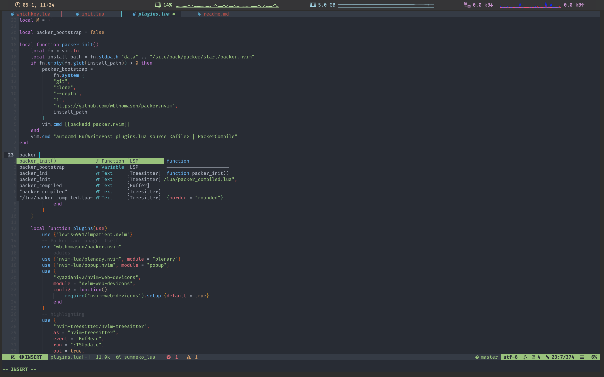
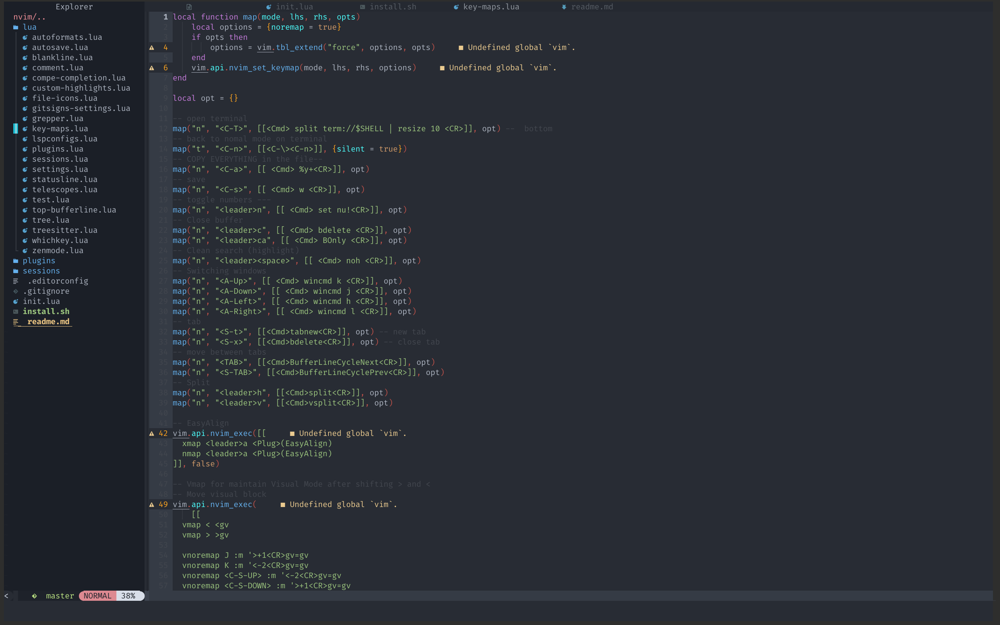
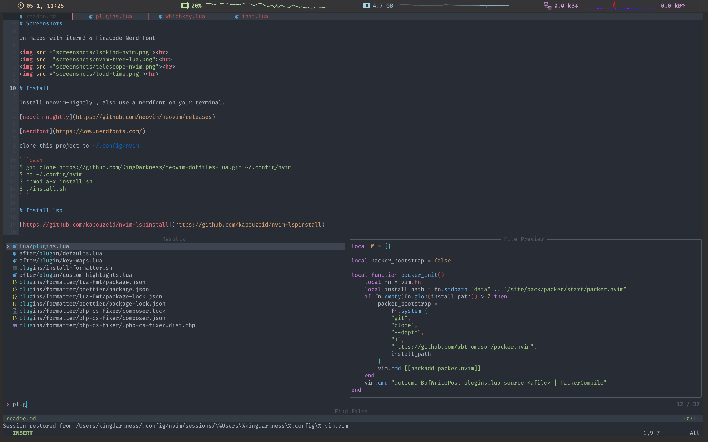
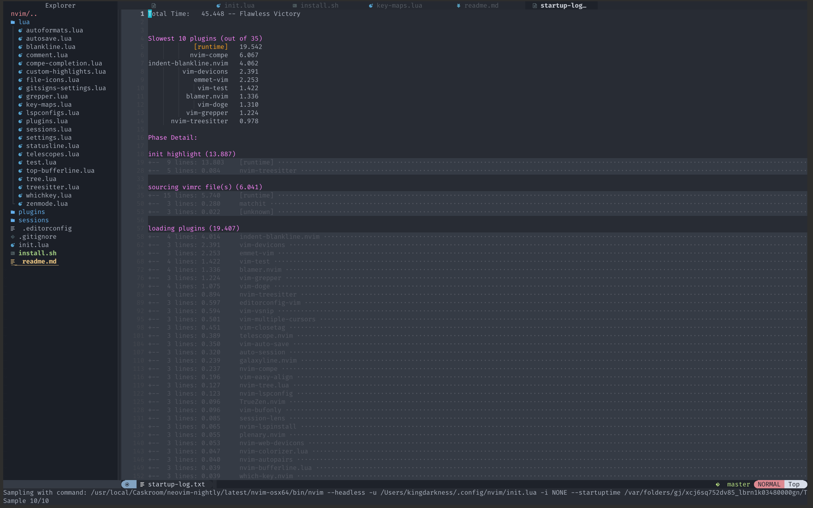

# Screenshots

On macos with iterm2 & FiraCode Nerd Font

<hr>
<hr>
<hr>
<hr>

# Install

Install neovim ^`0.5.0` , also use a nerdfont on your terminal.

[neovim](https://github.com/neovim/neovim/releases)

[nerdfont](https://www.nerdfonts.com/)

clone this project to ~/.config/nvim

```bash
$ git clone https://github.com/KingDarkness/neovim-dotfiles-lua.git ~/.config/nvim
$ cd ~/.config/nvim
$ chmod a+x install.sh
$ ./install.sh
```

# Install lsp

[https://github.com/williamboman/mason-lspconfig.nvim](https://github.com/williamboman/mason-lspconfig.nvim)

# Features

-   File navigation with Nvimtree
-   managing tabs with bufferline
-   autosave
-   icons on nvimtree , telescope , bufferline/statusline and almost everywhere! with nvim-web-devicons
-   minimal status line ( galaxyline)
-   gitsigns (colored bars in my config)
-   using nvim-lsp
-   williamboman/mason.nvim for nvim-lps configuration
-   nvim-compe for autocompletion
-   lspkind to show pictograms on autocompletion items
-   telescope for file finding , picking , previewing (files and even images)
-   nvim-treesitter for syntax highlighting
-   nvim-autopairs , for autolosing braces and stuffs
-   formatter.nvim for prettifying / formatting code
-   packer.nvim as package manager
-   indent-blankline.Nvim for indentlines
-   smooth scrolling
-   Snip support from VSCode through vsnip supporting custom and predefined snips (friendly-snippets)
-   Theme nvim-base16

#### show full in lua/plugins.lua

# Config structure

```
nvim
├── after
│   └── plugin
│       └── autoload.lua
├── init.lua
├── install.sh
├── lua
│   └── anything.lua
├── plugins
    ├── formatter
    │   └── formatter
    └── install-formatter.sh
```

-   The init.lua is used instead of init.vim.
-   The lua folder contains modules ( config files ) , in the example above anything.lua file in lua folder could be considered as a module.
-   The anything.lua file is supposed to have any neovim config written in lua , its like splitting the overall config into small bits and make it more organized , like one module for highlights and colors , another one for statusline and so on!.
-   To load or source that "anything" module (like making it load with init.lua ) ,add this is in init.lua : require "anything".

# Guides to migrate your nvim configs to init.lua -

-   [https://github.com/nanotee/nvim-lua-guide](https://github.com/nanotee/nvim-lua-guide)

-   [https://alpha2phi.medium.com/neovim-init-lua-e80f4f136030](https://alpha2phi.medium.com/neovim-init-lua-e80f4f136030)

-   [https://oroques.dev/notes/neovim-init](https://oroques.dev/notes/neovim-init)

## alias vi as nvim (optional)

add to bottom `~/.zshrc` or `~/.bashrc`

alias vi="nvim"
