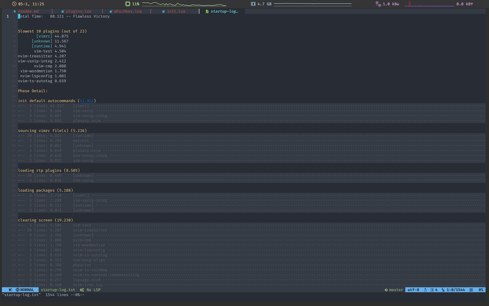

## Screenshots
<hr>
<hr>
<hr>
<hr>
## Install

Install neovim-nightly , also use a nerdfont on your terminal.

[neovim-nightly](https://github.com/neovim/neovim/releases)

[nerdfont](https://www.nerdfonts.com/)

clone this project to ~/.config/nvim

```bash
$ git clone https://github.com/KingDarkness/vimconfig-lua.git ~/.config/nvim
$ cd ~/.config/nvim
$ chmod a+x install.sh
$ ./install.sh
```

## Install lsp

[https://github.com/kabouzeid/nvim-lspinstall](https://github.com/kabouzeid/nvim-lspinstall)

Exp:
```vim
LspInstall php
````

## alias vi as nvim (optional)

add to bottom `~/.zshrc` or `~/.bashrc`

alias vi="nvim"
